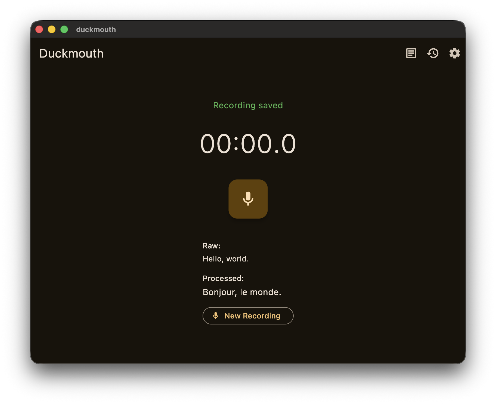
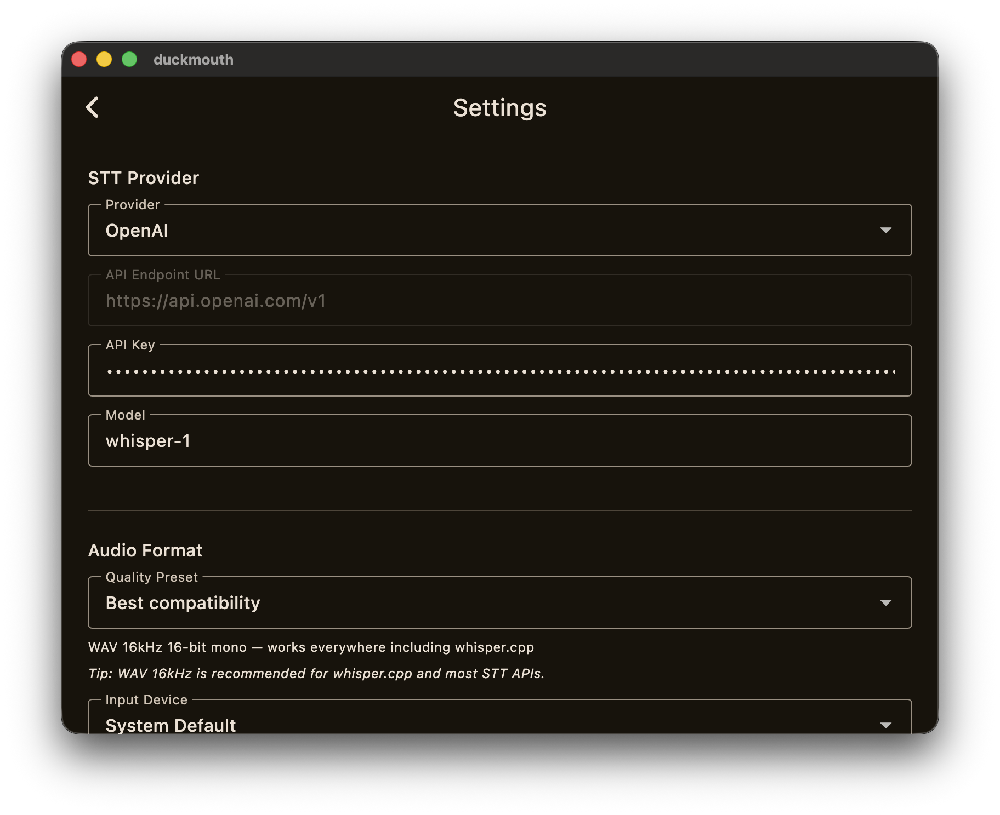
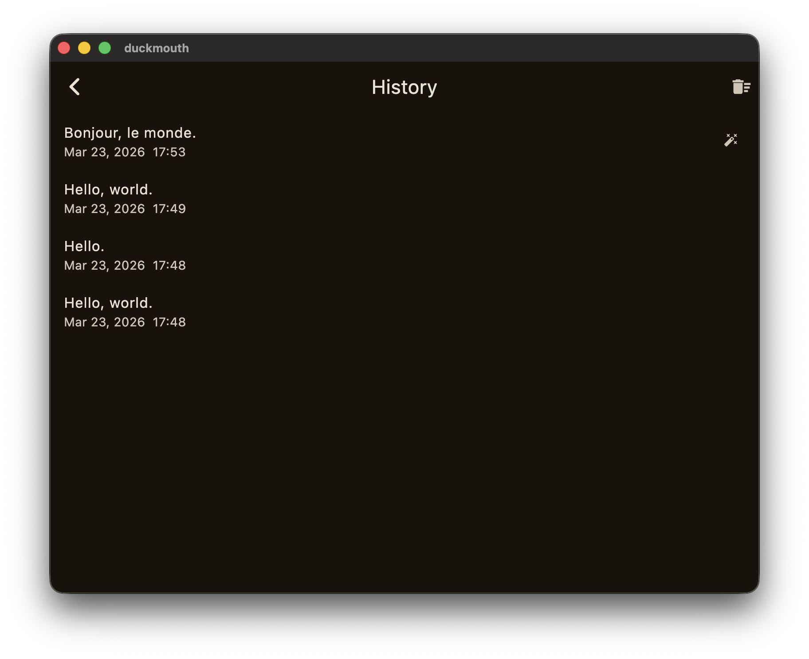
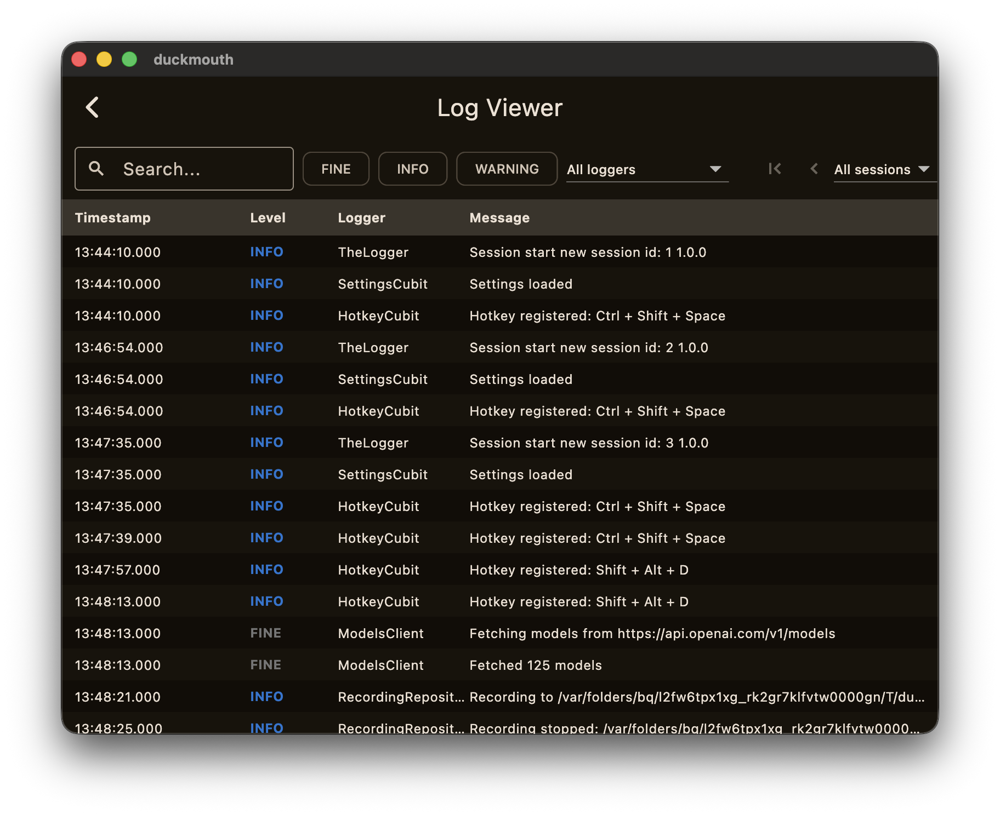

# Duckmouth

macOS speech-to-text app that lives in your menu bar. Record speech, transcribe it via any OpenAI-compatible API, optionally polish the result with an LLM, and get the text where you need it — clipboard, cursor, or both.

Built with Flutter & Dart using [dev-process-toolkit](https://github.com/nesquikm/dev-process-toolkit) — a spec-driven development workflow for Claude Code.

<p align="center">
  
  
</p>
<p align="center">
  
  
</p>

## Features

**Speech-to-Text** — Record from your mic and transcribe using OpenAI, Groq, or any compatible endpoint. Dynamic model discovery fetches available models automatically.

**LLM Post-Processing** — Optionally run transcriptions through an LLM to fix grammar, summarize, translate, reformat, or apply a custom prompt. Supports OpenAI, Groq, xAI (Grok), Google Gemini, and OpenRouter.

**Smart Text Output** — Copy to clipboard, paste at cursor via Accessibility API (with automatic fallback chain), or both. No clipboard clobbering.

**Global Hotkeys** — Push-to-talk or toggle mode with any key combo. Works system-wide.

**Menu Bar** — Sits in your menu bar with a status icon that changes while recording. Quick access to recent transcriptions without opening the full window.

**Transcription History** — Persistent list of past transcriptions with timestamps. Click to copy, swipe to delete.

**Sound Feedback** — Distinct sounds for recording start, stop, and transcription complete. Per-sound volume control with preview.

**In-App Log Viewer** — Built-in structured logging with real-time viewer, powered by [the_logger](https://pub.dev/packages/the_logger) and [the_logger_viewer_widget](https://pub.dev/packages/the_logger_viewer_widget). Filterable by level, logger name, and search text.

**Auto-Save Settings** — Changes persist immediately. No save button needed.

## Supported Providers

| Provider | STT | LLM | Default Model |
|----------|-----|-----|---------------|
| OpenAI | yes | yes | whisper-1 / gpt-5.4-mini |
| Groq | yes | yes | whisper-large-v3-turbo / llama-3.3-70b-versatile |
| xAI (Grok) | -- | yes | grok-4-1-fast-non-reasoning |
| Google Gemini | -- | yes | gemini-3-flash |
| OpenRouter | -- | yes | openrouter/auto |
| Custom | yes | yes | user-defined |

## Install

### Homebrew (recommended)

```bash
brew tap nesquikm/duckmouth
brew install duckmouth
```

### Manual (DMG)

Download the latest DMG from [Releases](https://github.com/nesquikm/duckmouth/releases), open it, and drag Duckmouth to Applications. Then strip the quarantine attribute (required for unsigned apps):

```bash
xattr -dr com.apple.quarantine /Applications/Duckmouth.app
```

**Universal binary** — works on both Apple Silicon (arm64) and Intel (x86_64).

## Development

### Prerequisites

- macOS
- [Flutter](https://flutter.dev) 3.41.5+ (via [FVM](https://fvm.app))

### Build & Run

```bash
# Install dependencies
fvm flutter pub get

# Run in debug mode
fvm flutter run -d macos

# Build release
fvm flutter build macos

# Build DMG for distribution
./scripts/build_dmg.sh
```

### Test

```bash
fvm flutter test
```

### Lint

```bash
fvm flutter analyze
```

## Audio Formats

- **WAV** (16kHz 16-bit mono) — maximum compatibility (default)
- **FLAC** (16kHz mono)
- **AAC** (32-64kbps) — smaller files
- **Opus** (OGG)

## Architecture

Feature-first structure with BLoC/Cubit state management and repository pattern:

```
lib/
├── app/              # App shell, routing, theme, menu bar
├── features/         # Feature modules
│   ├── recording/    # Audio capture
│   ├── transcription/# STT pipeline
│   ├── post_processing/ # LLM post-processing
│   ├── settings/     # Configuration UI & persistence
│   ├── history/      # Transcription history
│   └── hotkey/       # Global keyboard shortcuts
├── core/             # API clients, services, DI
└── main.dart
```

## Built With

- [dev-process-toolkit](https://github.com/nesquikm/dev-process-toolkit) — spec-driven development workflow for Claude Code
- [the_logger](https://pub.dev/packages/the_logger) — structured logging with masking and session management
- [the_logger_viewer_widget](https://pub.dev/packages/the_logger_viewer_widget) — in-app log viewer with filtering and real-time streaming

## License

MIT
